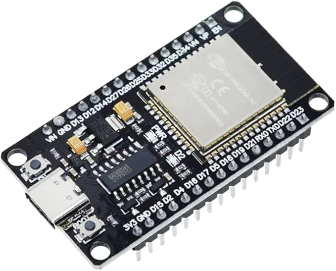

# 制御システム部２G　インターン（IoT編）

本カリキュラムは加藤製作所インターン参加者向けのサイトとなります。ご利用いただきたい方はご一報いただけると幸いです。

## 本カリキュラムの目的

- ESP32を通じてIoT・電子工作を身近なものとして感じる
- プログラミングをして、モノを動かす楽しみを知る
- IoTを活用した未来に思いをはせる

## IoTって何？

"Internet of Things"の頭文字で、
従来はインターネットに接続していなかった様々なデバイス"Things"が、
ネットワークを通じてサーバーやクラウドに接続されて、情報交換をする仕組みを指します。

デバイスと一口にいっても、様々なものが現在では接続されており、ネットワークに接続することで様々なサービスが生まれています。

- センサー機器
- 自動車
- 建機
- 電気・ガスメータ
- 家電製品
- 住宅・建物

> [!NOTE]
> 自分の周りにIoTを使っているのでは？と考えられるサービスがないか相談してみよう。
> 既に使っているものが多数存在すると思います。
> いくつかサービスを列挙できたら、どのような仕組みで動いているのか調べたり、想像したりしましょう。
> 
> - 生活の中（サービス業・小売業） ではどうだろう
> - 農業ではどうだろう
> - 工業ではどんな事例があるだろう

## 建機とIoT

建機とデータを送受信できるとどんないいことがあるか考えてみよう

発展中の分野なので、様々なアイデアが生まれています。自分なりの答えを考えてみましょう。

- データを集められると何に使えるでしょう？
- データを建機に送れると何に使えるでしょう？
- データを欲しがっているのは誰でしょう？

IoTでは、データを収集すること以上に、データを活用することが大切です。ただし、データがないと活用することも出来ません。

> [!NOTE]
> Data:データとInformation:情報とは明確に異なります。本項ではふれませんが、インターンのデータ分析編ではこのあたりが「肝」となります。

今回の実習では、データを収集することにまずは着目しましょう。

## センサーとプロセッサ、アクチュエータ

センサーは、温度、湿度、圧力、光、音、加速度などの“物理的・環境的な量”や、“人間の操作”などを電気信号として読み取る役割を担います。

センサーは検知した物理量をアナログ電圧やデジタル信号（後述しますが、I²CやSPIなど）として出力します

プロセッサは、センサーから取得したデータをもとに、プログラムに従って必要な演算や判断を行います。

アクチュエータ（広義）は、プロセッサの指示に基づいてモーターを回転させる、バルブを開閉する、ヒーターを温める、ディスプレイに表示する、データを保存する、インターネットにデータを送信するなど、物理的な動作や可視化・出力を担当します。

> [!NOTE]
> IoTに限らず、物事を整理・改善する際にInput:入力・Process:プロセス・Output:出力を基に考えることは非常に有用です。自身の普段の活動を整理してみましょう。

## ESP32とは

今回は、ESP-WROOM-32(ESP32)を使ってIoTの基本を勉強します。

"ESP32"は上海のEspressif Systems社が開発し台湾のTSMCが製造する、Wi-FiとBluetoothを搭載したSoCマイクロコントローラです。
動作温度が-40℃から＋125℃まで安定した動作が可能で、超低消費電力設計で、多様な機能を実装した安価な製品で、IoTギークに大人気な製品です。

似たような用途で、ArduinoやRaspberry Piといったものが存在するので、興味があれば調べてみましょう。

以下に今回の実習で必要なESP32の機能、PINの働き、制約などをまとめたので、都度参照してください。

[ESP32リファレンス](esp32_doc/ReadMe.md)

> [!Warning]
> 勘違いのないように書いておくと、加藤製作所の建機にESP32が搭載されている訳ではありません。

## 実習準備

### 利用するデバイス

実習のサンプルプログラムは、以下のデバイスを利用することを想定して作成してあります。

- [開発ボード ESP32 ESP-WROOM-32 WiFi Bluetooth (USB Type-C)](https://www.amazon.co.jp/gp/product/B0C1444DRX/ref=ppx_yo_dt_b_asin_title_o03_s00?ie=UTF8&th=1)
- [IRヒューマンセンサーAM312](https://www.amazon.co.jp/gp/product/B084VMYMFZ/ref=ppx_yo_dt_b_asin_title_o02_s00?ie=UTF8&th=1)
- [６穴ブレッドボード](https://www.amazon.co.jp/%E3%82%B5%E3%83%B3%E3%83%8F%E3%83%A4%E3%83%88-SAD-101-%E3%83%8B%E3%83%A5%E3%83%BC%E3%83%96%E3%83%AC%E3%83%83%E3%83%89%E3%83%9C%E3%83%BC%E3%83%89/dp/B00DSKCS68)（ESP32-Devの幅が独特なので、通常の５穴のボードであれば２枚必要、6穴のものが推奨）
- LED（3.3Vで駆動する任意のLED１個）
- 抵抗器（3.3V電圧に応じたLEDに対する抵抗１個）
- ジャンパー線数本

### 開発環境のセットアップとESP32へのファームウエアの書き込み

次のページに環境構築の手順書を作成したので、開発環境を構築しましょう

[セットアップ手順](esp32_setup/ReadMe.md)

## 実習: ESP32を使って実際のIoTセンサーデバイスを作成しよう。

以下にThonnyによる開発の手順をまとめましたので、参照しながら実習を進めましょう。

[開発手順](esp32_dev/ReadMe.md)

以下に練習問題を用意しました。徐々に機能を勉強して、自分でIoTデバイスを作れるようになりましょう。

- [01.Hello Worldと表示してみよう](hello_world/ReadMe.md)
  - まずはESP32と触れ合ってみる
  - MicroPythonの基本構文に慣れる
- [02.オンボードのLEDを光らせてみよう](on_board_led/ReadMe.md)
  - GPIOの出力を経験する
  - タイマーや繰り返しを使いこなす 
- [03.オンボードの静電容量センサーを読み込んでみよう](capacitive_sensor/ReadMe.md)
  - アナログ値の読み込みを行う（センサーが動くことを体験する）
  - エラー処理を経験する 
- [04.オンボードの温度センサーを読み込んでみよう](analog_sensor/ReadMe.md)
  - 数値計算をする
  - 関数を作成する
- [05.抵抗と電流、LEDと抵抗を接続して光らせてみよう](blink_led/ReadMe.md)
  - 簡単な回路について学ぶ
  - 実際に結線してLEDを光らせる
- [06.人感センサーを接続して、状態をシリアルに表示しよう](infrared_detector/ReadMe.md)
  - GPIOの入力を経験する
  - 外部のセンサーを駆動して、値を取得する
- [07.イベントハンドラを実装してみよう](event_hundler/ReadMe.md)
  - 割り込みについて学ぶ
  - 構造化されたプログラムを作成する
- [08.Wi-Fiに接続してデータを送信してみよう](http/ReadMe.md)
  - デバイスをネットワークに接続する
  - HTTPの基本を理解する
- :triangular_flag_on_post: [09.人がいたら、LEDを点灯して、サーバーに通知してみよう](first_iot_device/ReadMe.md)
  - これまでに学んだことを、結集してIoTデバイスを開発する
- [10.アナログセンサーを読み込んでみよう](analog_sensor_2/ReadMe.md)
  - アナログ値の読込を経験して、取り扱えるセンサーの幅を広げよう
  - しきい値を基準にした処理の分岐を経験しよう
- [11.PWMを使って、LEDを調光してみよう](pwm/ReadMe.md)
  - PWMを使って、LEDを調光してみよう
  - アナログ値を光の強さで表現してみよう
- [12.I2Cセンサーを読み込んでみよう](i2c_sensor/ReadMe.md)
  - I2Cで通信で、コマンドの送信とデータの読込をしてみよう
  - バイト配列の取り扱いをしてみよう

以下は、ストレッチの課題となります。自分でセンサーを組み合わせたIoTデバイスを設計してみましょう。

- [13.センサーキットから好きなセンサーを選んで、デバイスを設計・試作しよう](practice13/ReadMe.md)
  - 自分で機能・仕様を考えられるようになる
  - 設計～試作まで自力で進められるようになる

ここまでくれば、様々なセンサーやアクチュエータを組み合わせて自分の力でデバイスを生み出すことができるはずです。

## 最後に

壊すことを怖がらずに、新しいものを作り出すことが大切だと思います。