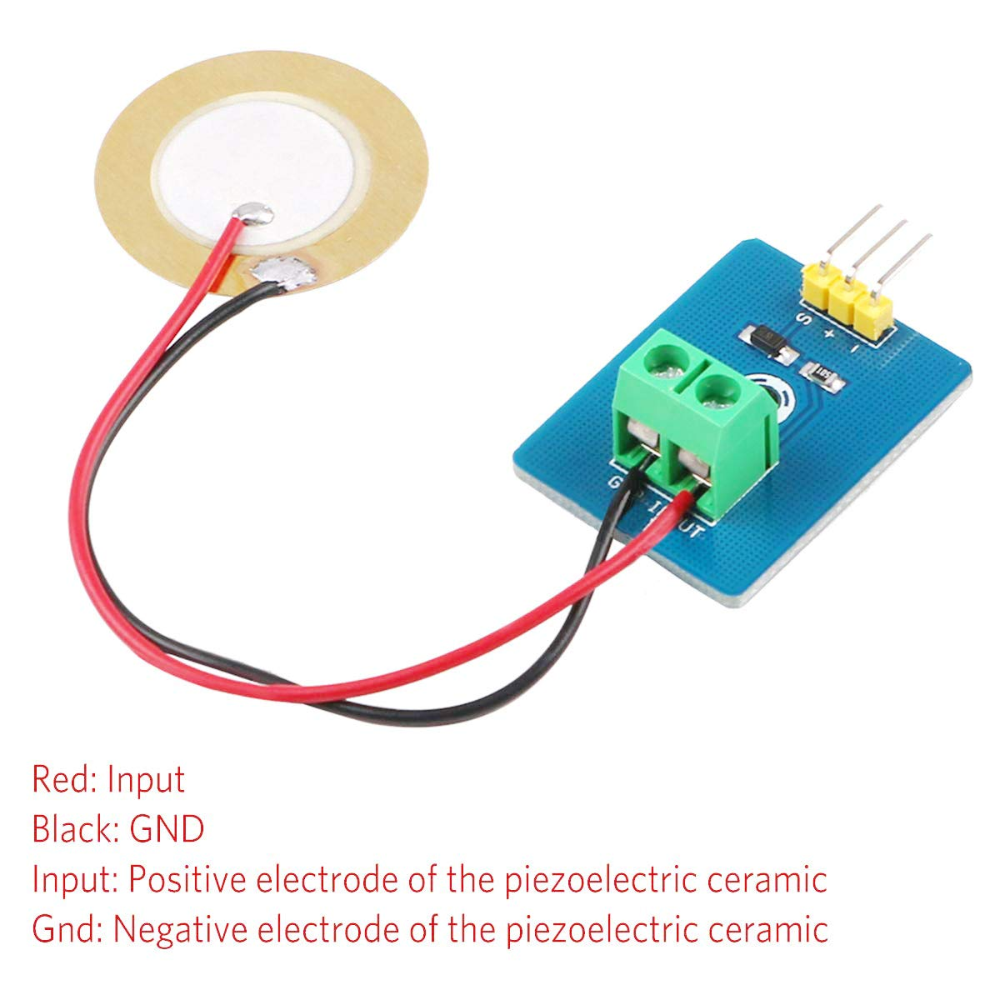
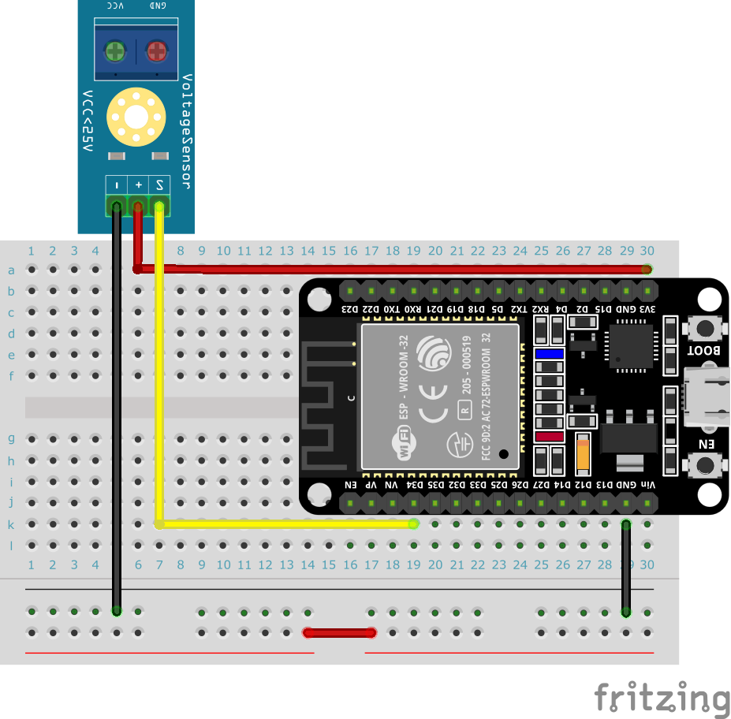

# IoT練習: 10.アナログセンサーを読み込んでみよう

## 本練習の目的

- アナログ値の読込を経験して、取り扱えるセンサーの幅を広げよう
- しきい値を基準にした処理の分岐を経験しよう

## 実装内容

仕様：振動センサーからアナログ値を読み込んで表示しよう



シリアルに分かりやすく振動量を表示する方法を考えてみましょう。

LEDを使った場合にはどのような方法が考えられるでしょうか。

以下のピンはWi-Fiと同時にアナログ値の読込はできないので気をつけましょう。

ADC2を利用するピン

- GPIO0
- GPIO2
- GPIO4
- GPIO12
- GPIO13
- GPIO14
- GPIO15
- GPIO25
- GPIO26
- GPIO27

## 以下を実行して結果を確認してみましょう

アナログ値の読込み

アナログ値を読み込む場合には、センサーに合わせて減衰を設定する必要があります。

- ADC.ATTN_0DB: 0 - 1.1V
- ADC.ATTN_2_5DB: 0 - 1.5V
- ADC.ATTN_6DB: 0 - 2.2V
- ADC.ATTN_11DB: 0 - 3.6V

```python
from machine import ADC, Pin
import time

# ADCピンの設定 (例えばGPIO34)
adc = ADC(Pin(34))
# ADCの幅を設定（通常は10ビット幅で0〜1023）
adc.width(ADC.WIDTH_10BIT)
# ADCの減衰を設定（デフォルトは0dB）
adc.atten(ADC.ATTN_11DB)  # 11dB attenuation (0-3.6V)

# ADC値の読み取り
value = adc.read()
# 読み取った値を表示
print("ADC Value:", value)    

```

アナログ値を分かりやすく表示する方法を考えて、表示の方法を工夫しよう。

```python
import time
import random


def print_range_bar(value, max_value):
    percent = int(100.0 * value / max_value)
    length = 30
    bar_length = int(30 * value / max_value)
    print('█' * bar_length + ' ' * (length - bar_length) + f' : {percent} %')


# 乱数で仮にボリュームを定義
volume = 50.0
max_volume = 100.0
while True:
    # 20%変動するとして乱数で処理する。
    change = random.random() * 20.0 - 10.0
    volume += change
    # 上限・下限の処理
    if volume < 0.0:
        volume = 0.0
    elif volume > max_volume:
        volume = max_volume
    # バーグラフの表示
    print_range_bar(volume, max_volume)
    time.sleep(0.1)
```

## ブレッドボードサンプル


