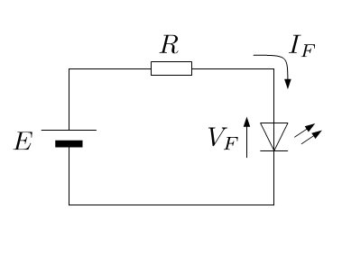
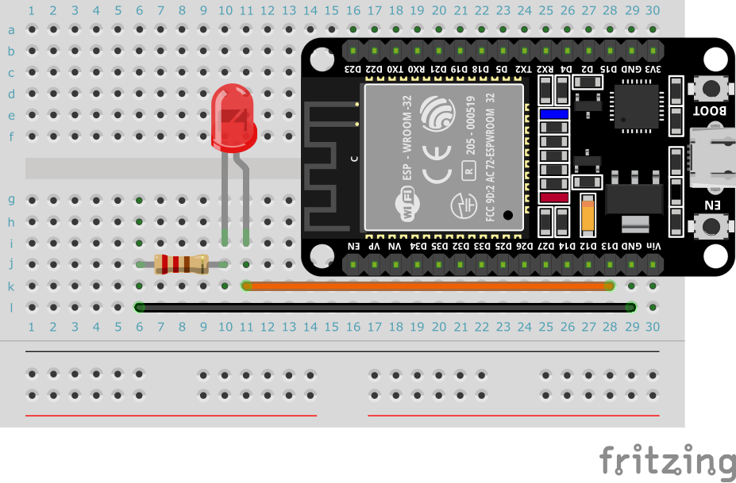

# IoT練習: 05.抵抗と電流、LEDと抵抗を接続して光らせてみよう

## 本練習の目的

- 簡単な回路について学ぶ
- 実際に結線してLEDを光らせる

## 実装内容

仕様：回路を作成して１秒間隔で、外部に接続したLEDを明滅させてみよう

プログラムはpractice02で実施したものと、ピンの番号が異なるだけです。

## 抵抗と電流

LEDは、長い足（アノード）を＋に短い足（カソード）を-に繋げると光るダイオードです。
LEDは一定電圧以上で電流を流すと光りますが、最大電流値を越える電流が流れると壊れてしまいます。回路に抵抗を入れることで流れる電流を調整します。

LEDは順方向電圧（Vf）がスペックとして決まっており、色によってその範囲が変わります。

- 赤色LED：約1.8V - 2.2V
- 緑色LED：約2.0V - 3.0V
- 青色LED：約3.0V - 3.6V
- 白色LED：約3.0V - 3.6V

ESP32から供給される駆動電圧3.3VとこのVfとの差、流したい電流量（スペックで最大電流量が10~20mA程度に規定されている）から、オームの法則に基づき抵抗を決めます。

- R: 抵抗（Ω）
- I: 電流（A）
- V: 電源電圧
- Vf: 駆動電圧

(V - Vf) / R = I

R = (V - Vf) / I = (3.3 V - 2.2 V) / 0.005 mA = 220 Ω

ESP32の好きなGPIOのピンから、ブレッドボード上の抵抗・LEDをつなげて、グラウンド（GND）まで回路をつなげてみましょう。

GPIOは、ONになると3.3Vの電圧がかかります。

## ブレッドボードサンプル

あくまでサンプルの配線なので、自分で思うように実装してください。

[トップへ戻る](../README.md)
