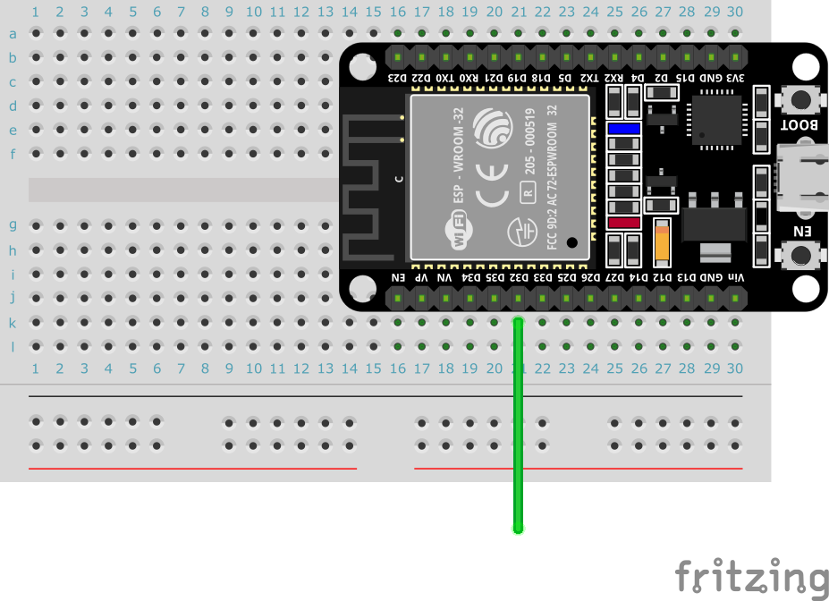

# IoT練習: 03.オンボードの静電容量センサーを読み込んでみよう

## 本練習の目的

- アナログ値の読み込みを行う（センサーが動くことを体験する）
- エラー処理を経験する

## 実装内容

仕様：0.2秒間隔で静電容量センサーの値を読み込み、読み込んだ値を表示する（指で触った際の数字の変化を観察する）

（表示出来たら、条件分岐を使って触れたらオンボードのLEDが点灯するようにしてみよう）

ESP32は静電容量の測定が可能なピンが存在します。人がピンに触ると、ピンにたまった電化が解放されるので数字が下がり、タッチセンサーとして利用することが出来ます。
（センサーから入ってくる値は0 ~ 4095の範囲です、中途半端に見えますが、12bitのアナログデジタルコンバータ（ADC)を利用しているため2^12のデジタル値に変換された結果です）

利用可能なピンは、ピン一覧のTouchの列に記載のあるピンですが、GPIO2は別の機能（LED）が割りあてられているので、別のピンを選びましょう。

- T0 : GPIO4
- T3 : GPIO15
- T4 : GPIO13
- T5 : GPIO12
- T6 : GPIO14
- T7 : GPIO27
- T8 : GPIO33
- T9 : GPIO32

センサーがグラウンドに繋がると、エラーが出るので対処したプログラミングが出来ると尚良いでしょう。

```text
Traceback (most recent call last):
  File "<stdin>", line 7, in <module>
ValueError: Touch pad error
```

## ブレッドボードサンプル

好きなピンからジャンプワイヤーを引き出してください。（下図だとGPIO32）



## 以下を実行して結果を確認してみましょう

センサーの値を読み込む

```python
from machine import Pin
from machine import TouchPad  # ライブラリからTouchPadを読み込む

# TouchPadで利用する際には、IN/OUTのモード設定は不要（INに設定してもよい）
pin = Pin(32, Pin.IN)
touch_pad = TouchPad(pin)  # ピン32をタッチパッドとして設定する
touch_value = touch_pad.read()  # タッチパッドの静電容量を読み込む
print(f'Touch value:{touch_value}')
```

エラーハンドリング

```python
from machine import Pin
from machine import TouchPad

touch_pad = TouchPad(Pin(2))
try:
    touch_value = touch_pad.read()
except ValueError:  # ValueErrorが発生したら、-1を読み込み値に設定する
    touch_value = -1
print(f'Touch value:{touch_value}')

```

[トップへ戻る](../README.md)
