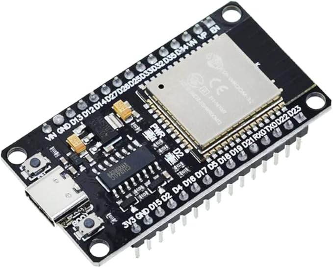
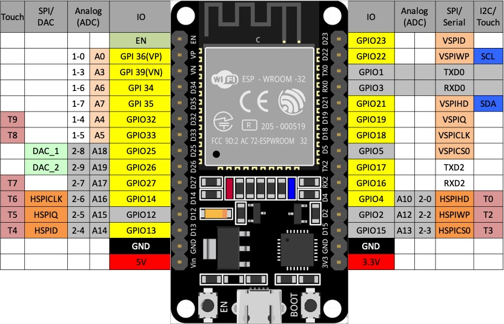

# ESP32 リファレンス

クイックスタートや、APIのリファレンスは下記から参照できます。
さらに詳細が知りたければ、じっくり読んでみましょう。

[ESP32 用クイックリファレンス](https://micropython-docs-ja.readthedocs.io/ja/latest/esp32/quickref.html)

## ESP32に組み込まれているセンサー

- 温度センサー
- 静電容量タッチセンサー

## ESP32のピン一覧

ESP32では32本のピンを持ち、プログラムから各ピンの機能・入出力を設定することができます。
GPIOを入力の場合にはON/OFFの読み出しを、出力の場合にはON/OFFの書き込みと読み出しができます。

各ピンからセンサーの状態を入力として読み込んだり、出力から周辺のデバイスを操作したりすることで、制御を実現します。

| GPIO | 特殊機能 | コメント |
| --- | --- | --- |
| 0 | BOOT/Flash Button | プルアップ内部抵抗 |
| 1 | TXD0 | UART0送信 (デフォルト) |
| 2 | BUILTIN LED | プルダウン内部抵抗 |
| 3 | RXD0 | UART0受信 (デフォルト) |
| 4 |  |  |
| 5 |  | プルアップ内部抵抗 |
| 6 | FLASH_CLK | フラッシュメモリ用 (使用しない) |
| 7 | FLASH_Q | フラッシュメモリ用 (使用しない) |
| 8 | FLASH_D | フラッシュメモリ用 (使用しない) |
| 9 | FLASH_HD | フラッシュメモリ用 (使用しない) |
| 10 | FLASH_WP | フラッシュメモリ用 (使用しない) |
| 11 |  | 使用しない |
| 12 | Boot Mode | プルダウン内部抵抗 |
| 13 | | |
| 14 | | |
| 15 | | プルダウン内部抵抗 |
| 16 | | 内部プルアップ |
| 17 | |  |
| 18 | |  |
| 19 | |  |
| 21 | |  |
| 22 | |  |
| 23 | |  |
| 25 | DAC1 | |
| 26 | DAC2 | |
| 27 |  |  |
| 32 |  | ADC1_4 |
| 33 |  | ADC1_5 |
| 34 |  | 入力専用、ADC1_6 |
| 35 |  | 入力専用、ADC1_7 |
| 36 | (VP) | 入力専用、ADC1_0 |
| 39 | (VN) | 入力専用、ADC1_3 |

> [!WARNING]
> - Wi-Fiが有効な場合、HSPI（SPI3）・ADC2のチャンネルは使用できません
> - GPIO6〜GPIO11は内部のフラッシュメモリに利用されているため使用できません

## ピンの配置

## 参考

- UART: 非同期式シリアルで２本で通信、機器間での通信に利用することが多い
  - 送信（TXD）
  - 受信(RXD)
- I2C: 同期式シリアルで２本で通信、１対多の通信を行なう。
  - SDA (Serial Data Line): データ転送のためのライン
  - SCL (Serial Clock Line): クロック信号のためのライン
- SPI: 同期式シリアルで4本で通信、１対多の通信を行なう。
  - 送信線　(SDO/MOSI[master]/MISO[Slave]) SPID
  - 受信線　(SDI/MISO[master]/MOSI[Slave]) SPIQ
  - クロック信号　(SCLK,CLK,SCK[Serial Clock]) SPICLK
  - スレーブ選択　(CS[Chip Select]/SS[Slave Select]/SYNC/ENABLE) SPICS0
  - 書き込み保護ライン(HSPI_WP / VSPI_WP)デバイスで書き込み保護機能を制御するために使用
  - 保持データライン（HSPI_HD / VSPI_HD）　デバイスを一時的に停止させるために使用さ

[トップへ戻る](../README.md)
