# 開発環境のセットアップとESP32へのファームウェアの書き込み

## ツール・ファームなど

シリアルドライバは、接続した際にポートが表示されない場合にインストールしてください。（WindowsではCOM、Macでは`/dev/tty.*`を確認）

- [Thonny](https://thonny.org/) Python IDE for beginners
- [FirmWare](https://micropython.org/download/ESP32_GENERIC/) ESP32 MicroPython FirmWare
- [CH340 Serial Driver](CH341SER.zip) シリアル接続ドライバ

> [!WARNING]
> シリアルドライバは、開発ボードの実装メーカーによって異なるので要注意です。オフィシャルサイトにも別のドライバのリンクが張られているので、マウントできなければこちらを試してください。
> 
> [Establish Serial Connection with ESP32](https://docs.espressif.com/projects/esp-idf/en/stable/esp32/get-started/establish-serial-connection.html)

## PCとの接続（ドライバのインストール）

1. ESP32のFirmwareをダウンロード
   - [FirmWare](https://micropython.org/download/ESP32_GENERIC/) ESP32 MicroPython FirmWare
   - 本実習ではESP32_GENERIC-20240602-v1.23.0.binで動作確認を行っています
   - 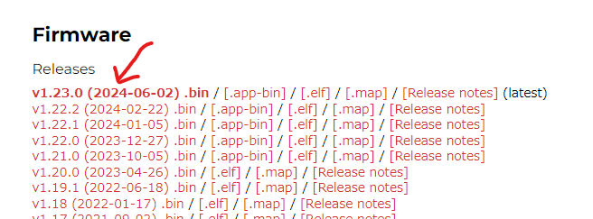
1. ESP32をPCにUSBケーブルで接続
1. Windowsの「デバイスマネージャ」を起動し「ポート(COMとLPT)」に「USB-SERIAL CH340 (COMXX) 」もしくは「Silicon Labs CP210x USB to UART Bridge (COMXX)」と表示されていることを確認
   - COMXXは各自で異なるので、メモしてください
   - 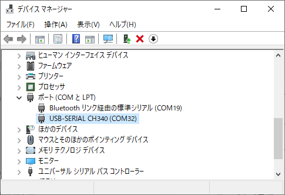
1. USB-SERIALの表示がない場合には、CH340のドライバをインストールして再接続
   - [CH340 Serial Driver](CH341SER.zip) CH340 シリアル接続ドライバ(解凍してSETUP.EXEを実行)
   - [CP210x Serial Driver](CP210x_Universal_Windows_Driver.zip) CP210x シリアル接続ドライバ（解凍してsilabser.infを右クリックし「インストール」を実行）

> [!NOTE]
> Macでは「デバイスマネージャ」はありません。ThonnyのPort一覧や、`/dev/tty.usbserial*`、`/dev/tty.SLAB_USBtoUART` のようなデバイス名が見えるかを確認してください。

> [!CAUTION]
> ESP32のUSBコネクタは強くないので、折らないように気を付けてください。

## ファームウェアの書き込み

1. Thonnyをダウンロードし、PCにインストール
   - 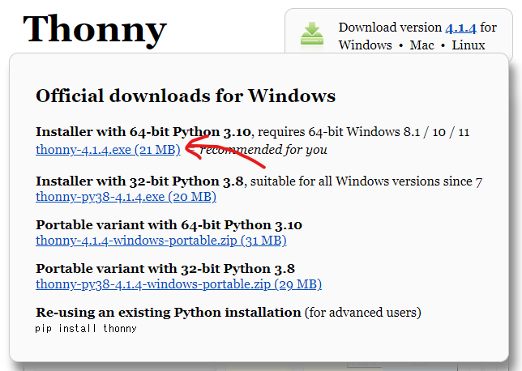
   - 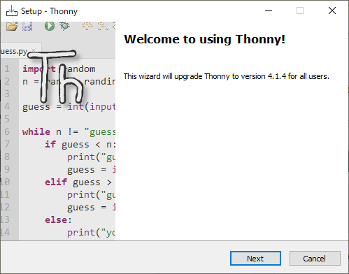
1. Thonnyを起動して、上部メニューの "Tools" - "Options" を選択
   - 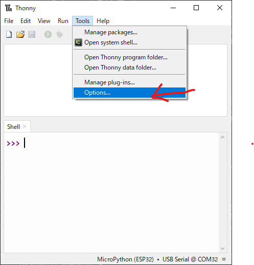
1. "Thonny Options"画面の、"Interpreter"のタブを開く
   - 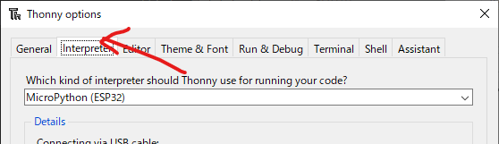
1. "Which kind of interpreter"から "MicroPython(ESP32)"を選択、"Port WebREPL"から、先ほどメモしたCOMの番号を選択
   - 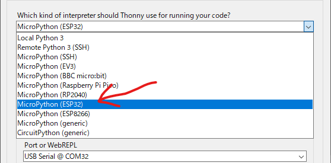
   - 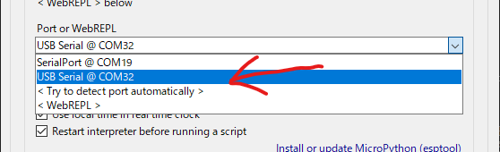
1. 「Install or Update MicroPython (esptool)」のリンクを選択
   - 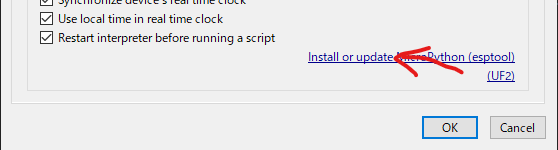
1. 「Install MicroPython (esptool)」のTarget portから、先ほどメモしたCOMの番号を選択
   - 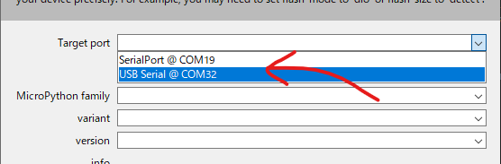
1. 下部のメニューボタン"≡"から"Select local MicroPython image"を選択し、先ほどダウンロードしたFirmwareを選択する。
   - 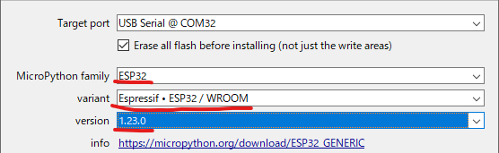
1. "Install"ボタンを押すと、ファームウェアの書き込みがはじまる
   - 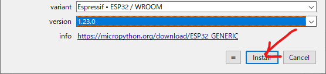
   - 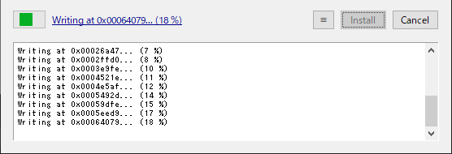
1. 書き込みが完了したら、"Close"を押して"Install or Update MicroPython (esptool)"画面を閉じる
   - 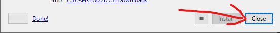
1. 「Thonny Options」画面の「OK」を押してオプション画面を閉じる
   - 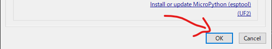
1. Thonnyの画面下部のShellに">>>"と表示されることを確認する。
   - 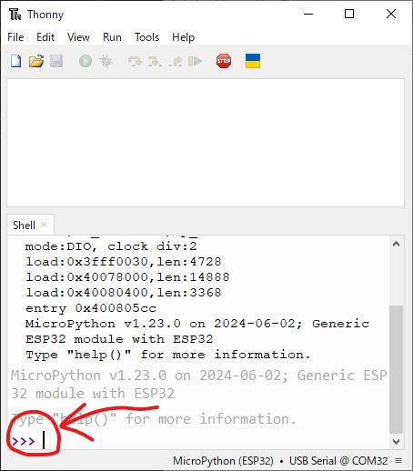

## プログラム実行の確認

1. Thonnyの上部の入力欄に、print('Hello')と入力し「F5」ボタンまたは緑の「Run」ボタンを押下
   - 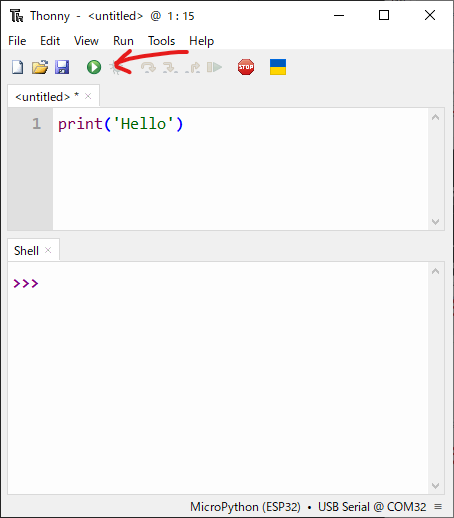
1. 下部の出力に"Hello"と表示されることを確認
   - 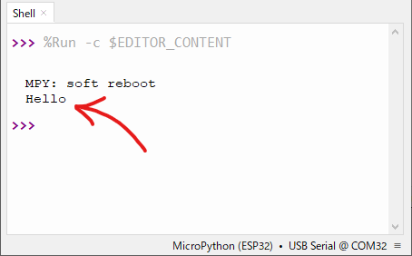

## ここまでできればOK

- ESP32をUSB接続するとPC側でポートが見える
- Thonnyで `MicroPython (ESP32)` を選択できる
- ファームウェアを書き込める
- `print('Hello')` が実行できる

## よくあるトラブル

### ポートが表示されない

- USBケーブルが充電専用でないか確認
- 別のUSBポートに挿し直す
- CH340 / CP210x のどちらのドライバが必要か確認
- 別のPCで認識するか確認

### 書き込みに失敗する

- Portの選択が正しいか確認
- 他のアプリがシリアルポートを使っていないか確認
- ESP32を抜き差ししてから再度実行
- うまくいかない場合は、基板の `BOOT` ボタンを押しながら再試行

### Shellに `>>>` が表示されない

- ThonnyのInterpreterが `MicroPython (ESP32)` になっているか確認
- STOP/RESTARTボタンで再接続
- Port設定を開き直して、正しいポートを選び直す

### `print('Hello')` を実行しても反応しない

- 下部のShellがESP32に接続されているか確認
- 実行先が `This Computer` ではなく `MicroPython device` になっていないか確認
- いったん短いコードだけをShellで直接実行して切り分ける

[トップへ戻る](../README.md)
