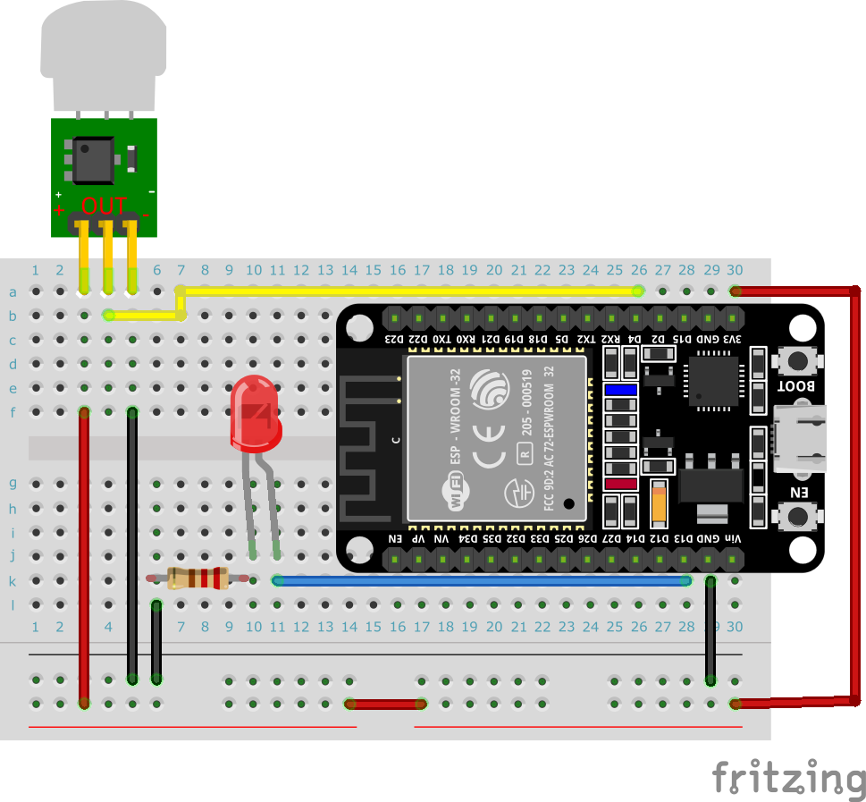

# IoT練習: 09.人がいたら、LEDを点灯して、サーバーに通知してみよう

ここまでの実習を通じて、人感センサが反応したらサーバに通知する仕組みを実装できるはずです。

全体を整理して、コードを組み立ててみましょう。

## 本練習の目的

- 本日学んだことを、結集してIoTデバイスを開発する

## 実装内容

仕様：人感センサが反応したら、サーバに通知をPOSTする

## 前提

この課題に入る前に、以下ができていることを確認してください。

- 人感センサの入力を読める
- LEDを点灯できる
- Wi-Fiに接続できる
- POSTリクエストを送れる

## 使うもの

- ESP32
- 人感センサ AM312
- LED
- 抵抗
- ジャンパー線
- Wi-Fiアクセスポイント

## 配線例

- 人感センサ
  - VCC -> 3.3V
  - GND -> GND
  - OUT -> GPIO13
- LED
  - GPIO12 -> 抵抗 -> LED -> GND

GPIO番号は例です。空いているピンに読み替えて構いません。

## まず決めること

- 人感を検知した瞬間だけ送るか
- 人が居続ける間は送信しないようにするか
- 送信失敗時に再送するか
- LEDは「検知中」を示すか、「送信成功」を示すか

## 処理の流れ

1. Wi-Fiに接続する
1. 人感センサの状態を読む
1. 検知したらLEDを点灯する
1. サーバにJSONをPOSTする
1. 一定時間は連続送信しない

## 最小構成のサンプル

```python
from machine import Pin
import network
import time
import urequests

SSID = 'intern2024'
PASSWORD = 'password2024'
URL = 'http://192.168.4.1:5000/'

pir = Pin(13, Pin.IN)
led = Pin(12, Pin.OUT)


def connect_wifi():
    wlan = network.WLAN(network.STA_IF)
    wlan.active(True)
    if not wlan.isconnected():
        wlan.connect(SSID, PASSWORD)
        while not wlan.isconnected():
            print('Connecting to network...')
            time.sleep(1)
    print('Network connected:', wlan.ifconfig())
    return wlan


def notify_detected():
    data = {
        'name': 'intern-device',
        'detected': True,
    }
    response = urequests.post(URL, json=data)
    print('Response status:', response.status_code)
    print('Response content:', response.text)
    response.close()


connect_wifi()
last_sent_at = 0

while True:
    detected = pir.value() == 1
    led.value(1 if detected else 0)

    if detected and time.time() - last_sent_at >= 5:
        notify_detected()
        last_sent_at = time.time()

    time.sleep(0.1)
```

## ここまでできればOK

- 人が通るとLEDが点灯する
- 人を検知したときだけPOSTが送られる
- サーバの応答を確認できる
- 連続検知でサーバに大量送信しない

## 切り分けの順番

うまく動かない場合は、必ず以下の順で確認してください。

1. 人感センサだけを動かして `print()` で値を見る
1. LEDだけを動かす
1. Wi-Fi接続だけを確認する
1. POSTだけを送ってみる
1. 最後に全部を組み合わせる

## ストレッチ開発

製品開発を行う場合に仕様に書かれていないけど、運用していく上で必要となる機能が必ず存在します。

例えばパソコンと繋げているとシリアルからログが見れますが、
デバイス単体で動かす場合にはどのような機能が必要になるでしょうか。

各々で考えてみましょう。

- ボタンを押されると、最新データを強制的に送信する
- ボタンを押すまでWi-Fiとつながない、つながっていたら切断する
- Wi-Fiに繋がっているかどうかわかる
- サーバに送信成功したかどうかわかる
- 連続稼働時間がわかる
- 定期的に再起動する
- 最新プログラムをインターネットから自動更新する

（ESP32だけで動かす場合には、ESP32に"boot.py"や"main.py"という名前でファイルを保存します。）

## ブレッドボードサンプル

繰り返しになりますが、自由に実装してください。



[トップへ戻る](../README.md)
