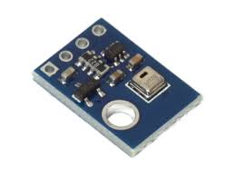
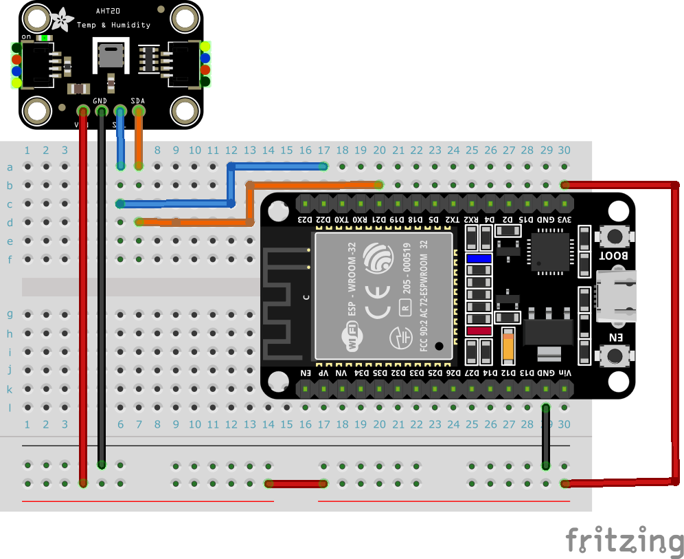

# IoT練習: 12.I2Cセンサーを読み込んでみよう

## 本練習の目的

- I2Cで通信で、コマンドの送信とデータの読込をしてみよう
- バイト配列の取り扱いをしてみよう

## I2Cとは

I2Cとは I2C（Inter-Integrated Circuit）はフィリップス社（現NXP社）が提唱する通信インターフェースで、クロックに同期させてデータの通信を行う同期式シリアル通信のひとつです。 I2CはSPIと並んで、EEPROMやセンサとのデータ通信によく使われています。

- I2C: 同期式シリアルで２本で通信、１対多の通信を行なう。
  - SDA (Serial Data Line): データ転送のためのライン
  - SCL (Serial Clock Line): クロック信号のためのライン
  
ESP32では、21ピンがSDAに22ピンがSCLに割り当てられています。
初期化の際には以下のように設定します。

```python
# I2Cの初期化
i2c = I2C(scl=Pin(22), sda=Pin(21), freq=400000)
```

## センサーのスペック

AHT20 I2C温度湿度センサー



AHT20のデータシートを読んでみよう

https://files.seeedstudio.com/wiki/Grove-AHT20_I2C_Industrial_Grade_Temperature_and_Humidity_Sensor/AHT20-datasheet-2020-4-16.pdf


AHT20のコマンド
```text
b'\xBE': 初期化
b'\xAC\x33\x00' : 測定指示
```

AHT20のデータレイアウト

```text
Byte 0: [Status]
Byte 1: [Humidity MSB]
Byte 2: [Humidity LSB]
Byte 3: [Humidity/Temperature Mix]
Byte 4: [Temperature MSB]
Byte 5: [Temperature LSB]
```

## 実装内容

仕様: I2C通信を行う温度・湿度センサーAHT20から値を読み込んで表示してみよう

## 以下を実行して結果を確認してみましょう

接続されたI2Cデバイスの一覧を表示してみよう

```python
from machine import Pin, I2C
import time

# I2Cの初期化
i2c = I2C(scl=Pin(22), sda=Pin(21), freq=400000)

# I2Cスキャン
devices = i2c.scan()

# 接続されたデバイスのアドレス一覧の表示
if devices:
    for device in devices:
        print("I2C device found at address:", hex(device))
else:
    print("No I2C devices found")
```

AHT20はアドレス0x38だと分かったので、センサーを読み込んでみよう

```python
from machine import Pin, I2C
import time

# SCLを22pin、SDAを21pinにしてi2cを初期化
i2c = I2C(0, scl=Pin(22), sda=Pin(21), freq=400000)

# アドレスの設定
addr = 0x38

# 初期化命令の送信
i2c.writeto(addr, b'\xBE')
time.sleep(0.02)

# データの計測指示
i2c.writeto(addr, b'\xAC\x33\x00')
time.sleep(0.02)

# データの読み込み
data = i2c.readfrom(addr, 6)
print(f'data:{data.hex()}')

# 湿度の計算
humidity = ((data[1] << 12) | (data[2] << 4) | (data[3] >> 4)) / (1 << 20) * 100
# 温度の計算
temperature = (((data[3] & 0x0F) << 16) | (data[4] << 8) | data[5]) / (1 << 20) * 200 - 50

print(f'Temperature: {temperature:.2f} C, Humidity: {humidity:.2f} %')
```

## ブレッドボードサンプル

センサー実装基板によって、ピンの配列が異なるので気を付けて。


