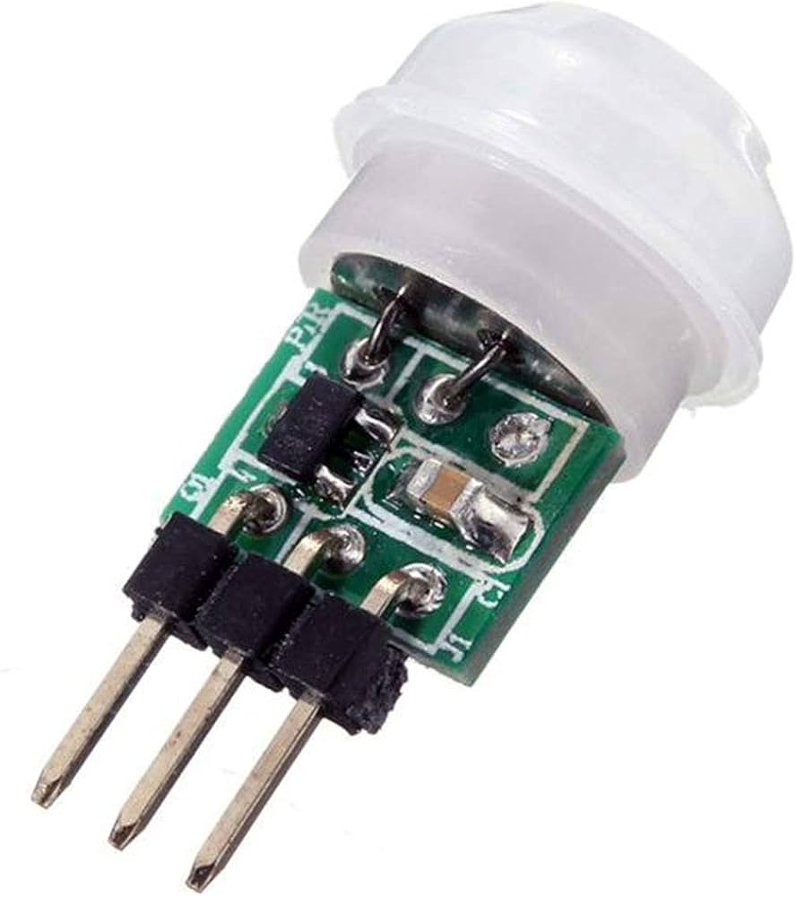
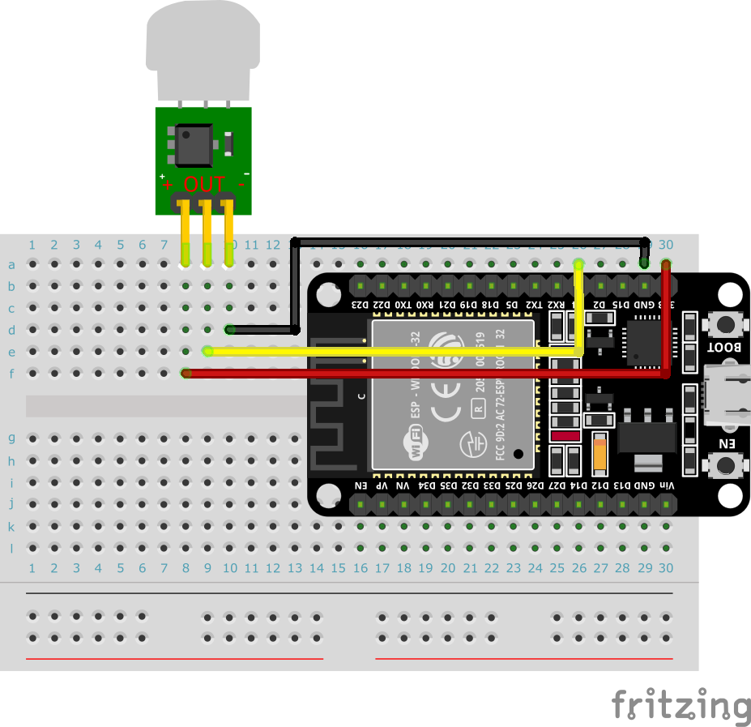

# IoT練習: 06.人感センサを接続して、状態をシリアルに表示しよう

## 本練習の目的

- GPIOの入力を経験する
- 外部のセンサを駆動して、値を取得する

## 実装内容

仕様：人感センサをESP32に接続して、センサ状態を１秒間隔で読み込み、ON/OFFの状態を表示する

練習02ではGPIOへの出力によるLEDの点灯を実装しましたが、本練習ではGPIOの入力によるセンサ値の読み取りを実装しましょう。

## センサのスペック

今回は以下のセンサを利用します。



- ミニ赤外線赤外線 モーションセンサ
- メーカー： PIR
- 型番： AM312
- 仕様
  - 動作電圧: DC 2.7 ~ 12V
  - 静的消費電力: <0.1ma
  - 遅延時間: 約2秒
  - 検出範囲： 3〜5m以内、コーン角100度以下
  - 動作温度: -20 ℃ ~ +60 ℃

データシート

https://www.image.micros.com.pl/_dane_techniczne_auto/cz%20am312.pdf

## センサとESP32の接続

センサからは３本の端子が出ておりそれぞれ

- VIN : センサ駆動用の電圧入力　ESP32の3V3(3.3V)かVIN(5V)の端子に接続
- OUT : センサが検出時に電圧が上がる、入力用のGPIOに接続
- GND : グランド（GND）に接続

## 以下を実行して結果を確認してみましょう

PINの入力を知る

```python
from machine import Pin

ir_sensor = Pin(4, Pin.IN)  # GPIO4を、入力ピンとして設定
value = ir_sensor.value()  # ピンの値を読み込む
print(f'ir_sensor: {value}')
```

## ブレッドボードサンプル

あくまでサンプルの配線なので、自分で思うように実装してください。



[トップへ戻る](../README.md)
