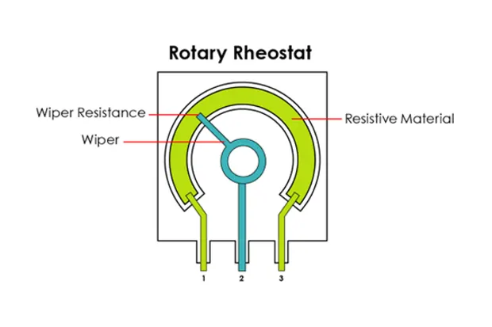
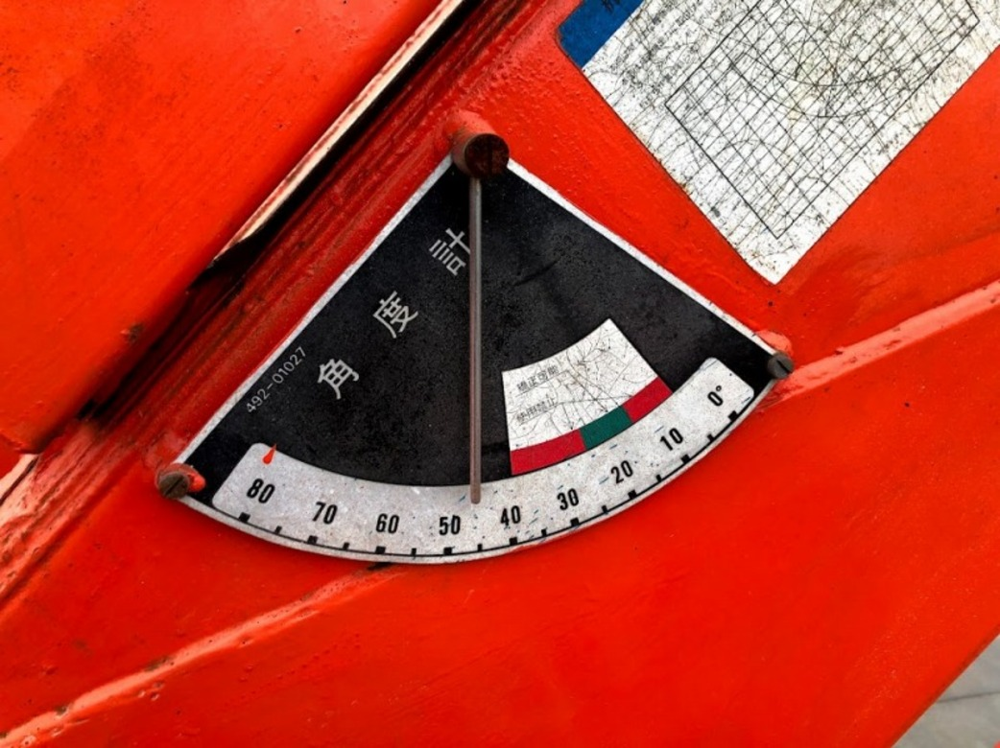

# クレーンのセンサを体験してみよう：角度を測る

## 本練習の目的

- ポテンショメータの仕組みを知る
- ポテンショメータを使ってみよう

## ポテンショメータの構造



ポテンショメータ（または可変抵抗器）は、抵抗値を調整できる電子部品で、主に電圧の分圧や信号の調整に使用されます。

ポテンショメータは通常、3つの端子を持っています：

- 端子A: 一端の固定端子。電源や入力信号が接続されます。
- 端子B: もう一端の固定端子。通常はグラウンド（GND）や負の電源が接続されます。
- 端子W（ワイパー）: 可変端子。回転またはスライド操作により、端子Aと端子Bの間で位置を変え、出力電圧を調整します。

ポテンショメータは、内部に抵抗体と、その上を移動する接触部（ワイパー）を持つ構造です。このワイパーが移動することによって、端子Aと端子Bの間の抵抗が変化します。

## 電気的な仕組み

ポテンショメータは通常、分圧器として使用されます。具体的には、次のような方法で動作します：

- 端子Aに供給される電圧（入力電圧）と、端子Bのグラウンド（または負の電圧）を使って、端子Wで取り出す出力電圧を決定します。
- 出力電圧（端子W）は、端子Aと端子Bの間の電圧分割により決まります。
- ワイパーが端子Aに近い場合、端子Wで取り出される電圧は端子Aに近い低い値になります。
- ワイパーが端子Bに近い場合、端子Wで取り出される電圧は端子Bに近い高い値になります。

## 使用例

音量調整: 音響機器でよく使われるポテンショメータは、音量の調整用です。入力信号（音声）の強さに応じて、ポテンショメータで信号の電圧を変化させます。

センサ: ロータリーエンコーダーや角度センサとして使用され、角度に応じて出力電圧を変化させることができます。

電圧調整: 実験や回路設計で電圧を調整するために使われます。
まとめ

ポテンショメータは、回転またはスライド操作により、端子間の抵抗を変化させ、それによって出力電圧を調整することができる部品です。内部には抵抗体と可動部分のワイパーがあり、これを動かすことで、出力電圧を変更できます。主に分圧器として利用され、音量調整やセンサ、電圧調整など多岐にわたる用途があります。

## 購入センサ

[KKHMF 10個 B10K トップ調整シングル回しローレット軸ボリューム ポテンショメータ10Kオーム](https://www.amazon.co.jp/gp/product/B073LQ38LL)

10kΩのポテンショメータを用意しています。

## 動かしてみよう

### 配線

- ポテンショメータの端子1 → 3.3V（ESP32のVCC）
- ポテンショメータのワイパー端子（2） → ESP32のアナログ入力ピン（例えば、GPIO34）
- ポテンショメータの端子3 → GND（ESP32のGND）

### プログラム例

```python
from machine import Pin, ADC
import time

# アナログピンの設定（GPIO34）
potentiometer_pin = ADC(Pin(34))  # GPIO34はアナログ入力対応ピン
potentiometer_pin.atten(ADC.ATTN_11DB)  # 測定範囲を0〜3.3Vに設定

while True:
    # ポテンショメータの現在のアナログ値を読み取ります。
    # 値は0〜4095の範囲で返されます（12ビット分解能）。
    sensor_value = potentiometer_pin.read()
    
    # 読み取った値を0〜100%の範囲に変換
    angle = int(sensor_value / 4095 * 100)
    
    # 角度を表示
    print("Current Angle: ", angle)
    
    # 1秒ごとに更新
    time.sleep(1)

```

## 実際に角度を測るにはどうしたらいいでしょう？

地面とブームの間の角度はどのようにしたら測れるでしょうか。



- 割合をどのように実際の角度に変換するか
- 0点をどのように調整するか
- センサにどのような部品を組み合わせるか
- クレーンのどこに取り付けるか
- どのように通信するか
  
## ポテンショメータ以外の測り方はないか？

ポテンショメータ以外に角度を測る方法はないでしょうか。

新しい手法を考えたとしたら

- メリットは？
- デメリットは？
- 特許は？
- コストは？
- 堅牢性は？
- 精度は？

製品化に向けては様々な課題があるかもしれませんが、技術革新が待っているかもしれません。
