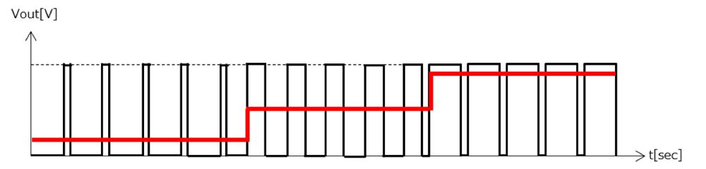
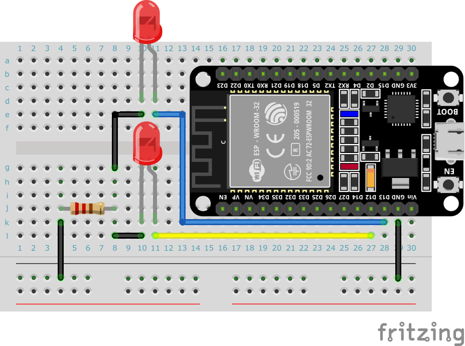

# IoT練習: 11.PWMを使って、LEDを調光してみよう

## 本練習の目的

- PWMを使って、LEDを調光してみよう
- アナログ値を光の強さで表現してみよう

## PWMとは

PWMとは、Pulse Width Modulationの略でパルス幅変調とも言います。
特定の矩形波パルスを使用して電気機器への電力を効率よく制御するための一般的な技術です。
PWM信号は、主に半導体の通電/非通電のデューティ比(ON/OFFとなる時間の割合)を制御するために利用されます。


デューティー比を変えることで、平均電圧を変更することができます。



PWMは３相モータを制御するための正弦波を生み出す重要な技術です。

## 実装内容

仕様: ESP32のPWM機能を利用して、LEDの明るさを周期的に変化させよう

２本のLEDを点けて、１本だけ変化させて明るさを比べてみよう

## 以下を実行して結果を確認してみましょう

500Hzの周波数でON/OFF出来るように設定して、ON時間を25%(256/1024)に設定してみよう。

```python
from machine import Pin, PWM
import time

# GPIOピンの番号を指定
led_pin = 13

# Pinオブジェクトを作成
led = Pin(led_pin, Pin.OUT)

# PWMオブジェクトを作成
pwm = PWM(led)

# PWMの周波数を設定（例: 500Hz）
pwm.freq(500)

duty = 256

# 25%デューティサイクル
pwm.duty(duty)
```

周波数を20Hzまで落とすとどのように見えるでしょうか。

```python
from machine import Pin, PWM
import time

led_pin = 13
led = Pin(led_pin, Pin.OUT)

pwm = PWM(led)

# PWMの周波数を設定（例: 20Hz）
pwm.freq(20)

duty = 256
pwm.duty(duty)
```

dutyの値を0~1023まで色々変えてみよう。

```python
from machine import Pin, PWM
import time

led_pin = 13
led = Pin(led_pin, Pin.OUT)
pwm = PWM(led)
pwm.freq(500)

duty = 10
pwm.duty(duty)
```

## ブレッドボードサンプル



## PWMを測定してみよう

PWMを利用して動いているデバイスを解析してみよう。

```python
from machine import Pin
import time

# PWM信号の入力ピン
pwm_pin = Pin(14, Pin.IN)

def measure_pwm(pin):
    # ハイとロウの時間を計測
    high_time = 0
    low_time = 0
    
    # ピンがHIGHになるまで待つ
    while pin.value() == 0:
        pass
    start_time = time.ticks_us()  # マイクロ秒単位での時間測定開始
    
    # ピンがLOWになるまでのHIGHの時間を計測
    while pin.value() == 1:
        pass
    high_time = time.ticks_diff(time.ticks_us(), start_time)
    
    # ピンがHIGHになるまでのLOWの時間を計測
    start_time = time.ticks_us()
    while pin.value() == 0:
        pass
    low_time = time.ticks_diff(time.ticks_us(), start_time)
    
    # 周期時間とデューティサイクルを計算
    period = high_time + low_time
    duty_cycle = (high_time / period) * 100
    
    return period, duty_cycle

# PWM信号の計測
while True:
    period, duty_cycle = measure_pwm(pwm_pin)
    print("Period: {} us, Duty Cycle: {:.2f}%".format(period, duty_cycle))
    time.sleep(1)
```
