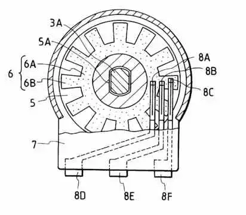
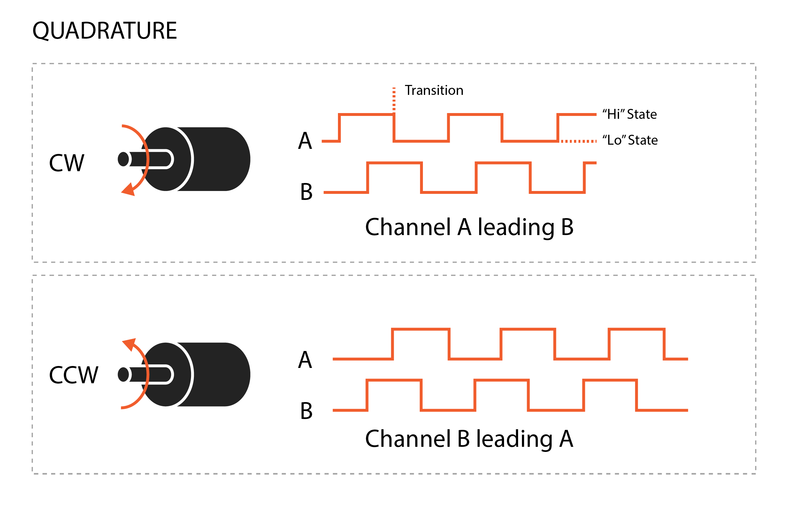

# クレーンのセンサを体験してみよう：回転・長さを測る

## 本練習の目的

- ロータリーエンコーダの仕組みを知る
- ロータリーエンコーダを使ってみよう

## ロータリーエンコーダの構造

ロータリーエンコーダは、回転運動をデジタル信号に変換するためのセンサーで、主に回転角度、回転方向、回転速度などを測定するために使用されます。主に産業機器、ロボット工学、オートメーションシステムなどで利用されています。

ロータリーエンコーダには、光学式・磁気式・機械式などさまざまな方式が存在します。

主な構成要素

- シャフト:
  - ロータリーエンコーダの中心軸で、回転する物体に取り付けられます。このシャフトが回転することで、エンコーダの出力が変化します。
- 回転ディスク:
  - シャフトに取り付けられた円盤状の部品で、光学エンコーダでは透過光を利用したスリットが入ったディスク、磁気エンコーダでは磁気パターンが印刷されたディスクが使われます。機械式では導体が歯車状に配置されています。（下図参照）
  - このディスクは回転に応じて、センサーが読み取るパターンを提供します。
- センサ:
  - 光学エンコーダでは、ディスクにあるスリットやパターンを光センサ（LEDとフォトダイオード）で読み取ります。回転ディスクにスリットが配置されている場合、スリットが通過するたびに光が遮断されたり通過したりして信号を生成します。
  - 磁気エンコーダでは、ディスクに配置された磁気パターンが、エンコーダ内のホール効果センサーで検出され、回転信号が生成されます。
  - 機械式エンコーダでは、接点がずらしてディスクに接触しており、下図の8D-8E/8D-8Fが異なるタイミングでON/OFFすることで信号を生成します。
- 出力信号:
  - インクリメンタルエンコーダは、回転ごとに一定の数のパルスを生成します。このパルス数をカウントすることで、回転の角度や位置を知ることができます。
  - 通常、2つの信号（A相、B相）が出力され、これらの信号の位相差を利用して回転方向を判別します。また、C相（インデックス信号）を使用することもあり、これは回転が1回転したことを示す信号です。
- 分解能:
  - 分解能とは、1回転あたりに出力されるパルスの数で、通常「PPR（Pulses Per Revolution）」で表されます。例えば、分解能が360PPRのエンコーダは、1回転につき360個のパルスを出力します。



今回は機械式のロータリーエンコーダを利用しますが、一般的には安価ですが寿命が短いとされています。（動作寿命15,000回~100,000回程度）

## ロータリーエンコーダと波形

ロータリーエンコーダでは、回転するとA/B２種類の信号がズレてON/OFFすることで、回転量と回転方向を計測できます。

下図のCWが正転方向に軸を回転させた際の信号の様子、CCWが逆方向に軸を回転させた際の信号の様子です。

信号Aが立ち上がった（ONになった）回数が回転量ですが、BがONかどうかで回転方向がわかります。



つまり、イベントハンドラでAの立ち上がりを検知して、BがONであればカウントアップ・OFFであればカウントダウンすることによって、トータルの回転量を知ることができます。

## ピン配置

今回用意したセンサーのピン配置は以下のとおりです。

|ピン番号 | ラベル | 説明 |
|-- | -- | -- |
| A | CLK (A相) | 回転検出信号（デジタルA相） |
| B | DT (B相) | 回転検出信号（デジタルB相） |
| C | GND | グラウンド |
| D | SW | プッシュボタン信号（スイッチ出力） |
| E | (ボタンのGND) | プッシュボタンのグラウンド接続（内部でGNDに接続される場合あり） |

<image src="product_detail_fig_ec11_d_84_ja_97c51f897a.gif" width="150px">

https://tech.alpsalpine.com/j/products/detail/EC11E15244B2/

## 配線例

以下の例では、ESP32に接続する場合の推奨配線を示します。

- 電源 (VCC):
  - ESP32の3.3Vピンに接続（エンコーダが3.3V対応の場合）。
  - 5V専用の場合は電圧レベル変換が必要。
- グラウンド (GND):
  - ESP32のGNDに接続。
- A相 (CLK):
  - ESP32のデジタル入力ピン（例: GPIO4）に接続。
- B相 (DT):
  - ESP32のデジタル入力ピン（例: GPIO5）に接続。
- スイッチ (SW):
  - ESP32のデジタル入力ピン（例: GPIO16）に接続。
  - 必要ならプルアップ抵抗（10kΩなど）を使用。

## サンプルプログラム

```python
from machine import Pin
import time

# GPIOピン設定
pin_a = Pin(4, Pin.IN, Pin.PULLUP)  # A相
pin_b = Pin(5, Pin.IN, Pin.PULLUP)  # B相

# グローバル変数
total_count = 0  # 総カウント数

# 割り込みハンドラ
def rotary_interrupt(pin):
    """
    A相が立ち上がった際に実行される
    """
    global total_count
    if pin == pin_a:
        # B相の状態で回転方向を判定
        if pin_b.value() == 0:  # 時計回り
            total_count += 1
        else:  # 反時計回り
            total_count -= 1

# 割り込みの設定
pin_a.irq(
    trigger=Pin.IRQ_RISING, 
    handler=rotary_interrupt
)

# メインループで総カウントを表示
try:
    while True:
        print(f"Total Count: {total_count}")
        time.sleep(1)  # 1秒ごとに更新
except KeyboardInterrupt:
    print("プログラム終了")

```
  
## 長さを測るにはどうしたらいいでしょう

ロータリーエンコーダで取得できるのは、回転数です。この値を長さに変換するにはどうしたらいいでしょうか。

例えば

- 測量ではタイヤが回転することで距離を測ります
- デジタルノギスでは、パターンを読み込むことで距離を測ります

クレーンでは、様々な場所の長さを測る必要があります。

- ブーム長さ
- アウトリガ長さ

このような場所でどのように計測すればよいでしょう。また、計測したデータをどのように転倒防止装置に伝えたらようでしょうか。

クレーンでは、巻き尺のような仕組みでワイヤーを引き出し、ロータリーエンコーダを回転させることで長さを計測しています。

## ロータリーエンコーダ以外の測り方はないか？

ロータリーエンコーダ以外に角度を測る方法はないでしょうか。
