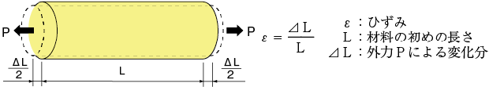
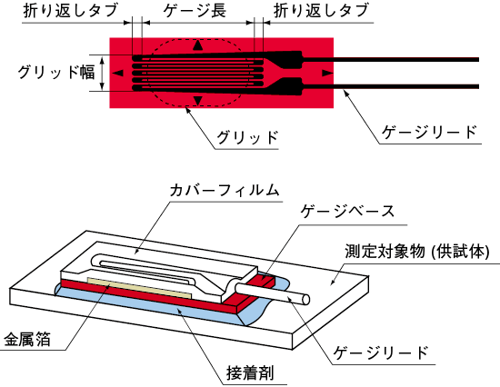

# クレーンのセンサを体験してみよう：重さを量る

## 本練習の目的

- ひずみゲージの仕組みを知る
- ひずみゲージを使ってみよう

## ひずみゲージの原理

ひずみゲージは、物体にかかる力や圧力によって物体が変形（ひずみ）する際、その変形を感知するために抵抗値の変化を利用します。ひずみゲージは、物体に取り付けてその表面の変形を測定し、変形による抵抗の変化を電気的に計測します。

1. ひずみとは：

   ひずみ（strain）は、物体の長さが変わることによって生じる割合であり、次の式で表されます。

   ひずみ（strain）= Δ𝐿 / 𝐿​ 

   ここで、Δ𝐿は物体の長さの変化量、Lは物体の元々の長さです。
   
   

2. 抵抗の変化：

   ひずみゲージの原理は、物体の表面に取り付けた金属線（または薄膜）の長さや断面積が変化することによる抵抗の変化を利用します。

   金属線が引っ張られる（引張りひずみ）と、金属線の長さが伸びて断面積が小さくなり、抵抗が増加します。逆に、圧縮される（圧縮ひずみ）と、金属線の長さが縮み断面積が広がるため、抵抗が減少します。

3. ゲージファクター：

   ゲージファクター（GF）は、ひずみゲージの感度を表す値です。次の式で表されます：

   𝐺𝐹 = (Δ𝑅 / 𝑅) / (Δ𝐿 / 𝐿​)

   ε = Δ𝐿 / 𝐿 = Δ𝑅 / (K * 𝑅)

   ここで、Δ𝑅は抵抗の変化量、Rは元の抵抗、ΔLは長さの変化量、Lは元の長さです。
   ゲージファクターが大きいほど、ひずみを感知する精度が高くなります。

## ひずみゲージの構造

ひずみゲージは、一般的に以下のような構造をしています：

- 導線（金属線または薄膜）：

  ひずみゲージの本体部分は、非常に細い金属線（または薄膜）で作られています。この導線は非常に高精度で配置され、物体の表面に貼り付けられます。

  金属線の材料としては、ニクロムやカッパー（銅）など、抵抗値の変化が精密に反映される材料が使用されます。

- 基板（基盤）：

  ひずみゲージは、薄い基板に取り付けられています。この基板は、ゲージ自体が変形するのをサポートし、物理的な強度を提供します。

- 接着剤：

  ひずみゲージは物体の表面に取り付ける必要があるため、強力な接着剤で物体に貼り付けられます。この接着剤も高精度である必要があり、変形を正確に伝達できるものが選ばれます。

- 配線端子：

  ひずみゲージには、電気信号を外部の測定機器に伝達するための端子（配線）があります。これにより、抵抗の変化が電気的に計測され、ひずみとして読み取ることができます。

参考：東京測器研究所

https://tml.jp/knowledge/strain_gauge/about.html

## ホイートストンブリッジ回路

ホイートストンブリッジ回路は、4つの抵抗を用いて、未知の抵抗値を非常に高精度で測定する回路です。特に、ひずみゲージや温度センサー、圧力センサーなどでその応用が広がっています。物体の変形や温度変化、圧力の変化などに伴う微細な抵抗の変化を検出し、その情報を電気的な信号として出力するため、非常に精密な測定が可能です。

<image src="img_index04_0.png" width="300px">

ホイートストンブリッジ回路の構造
ホイートストンブリッジ回路は、次の4つの抵抗を使って構成されます：

R1、R2、R3、R4: 4つの抵抗

これらの抵抗は、4つの端子を持つ直線的な回路で配置されます。
通常、R2、R3、R4は既知の抵抗で、R1は未知の抵抗（例えば、ひずみゲージの抵抗など）です。

入力（E）: 回路全体に直流電圧を供給するために使用されます。

出力（e）: ブリッジ回路の中央から出力される信号を測定するための端子で、ここで出力電圧（差動電圧）を検出します。

出力（e）= (R1*R3 - R2*R4) * E / ((R1 + R2) * (R3 + R4))

つまり、抵抗値のバランスが取れていれば、出力は0となります。

R = R1 = R2 = R3 = R4

とすると、変化量がΔＲとすると、

Δe = ΔＲ * E / (4R + 2ΔＲ)

となり、発生したヒズミを得ることができる。

## HX711による増幅と、データの取得

歪みゲージによる値の変化は非常に小さいため、アンプを通じて増幅した
値を取得する必要がある。

HX711は、ひずみゲージ（通常はロードセル）を使用したアナログ信号の変換を行うための専用の**24ビットADC（アナログ-デジタルコンバータ）**です。このICは、主に重量測定や力の測定など、非常に小さな変化を高精度で検出するために使用されます。HX711は、ひずみゲージの信号を増幅し、デジタルデータとして処理することで、非常に高精度でデジタル化されたデータを提供します。

